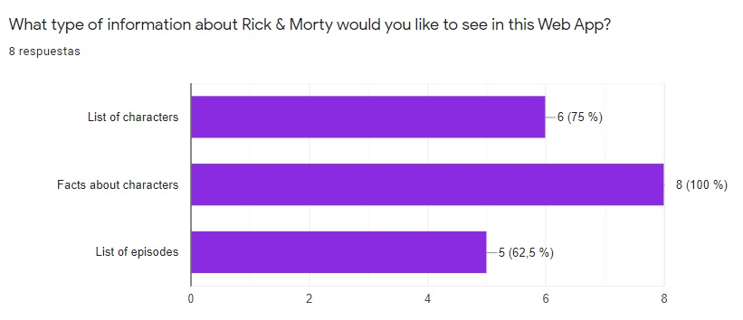
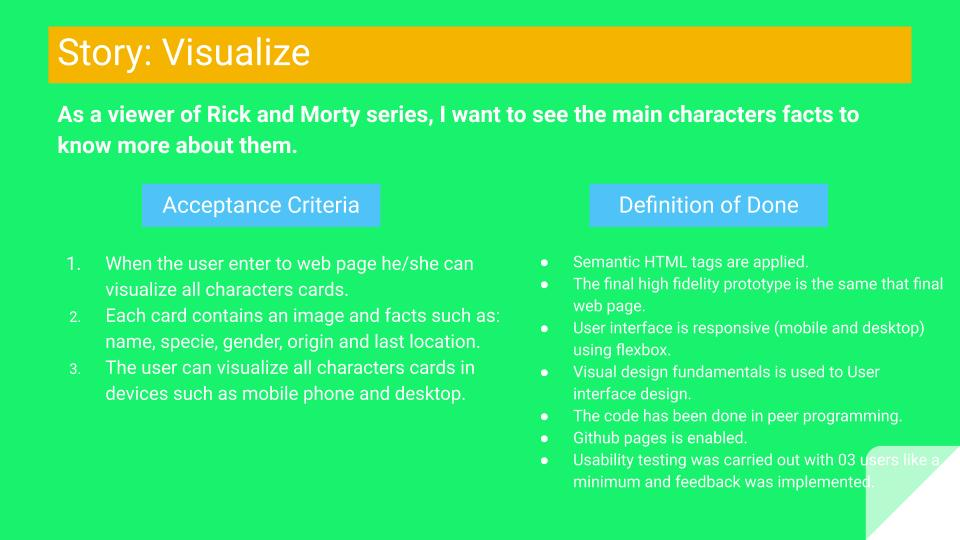
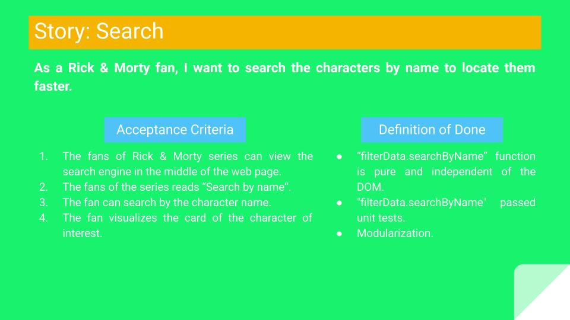
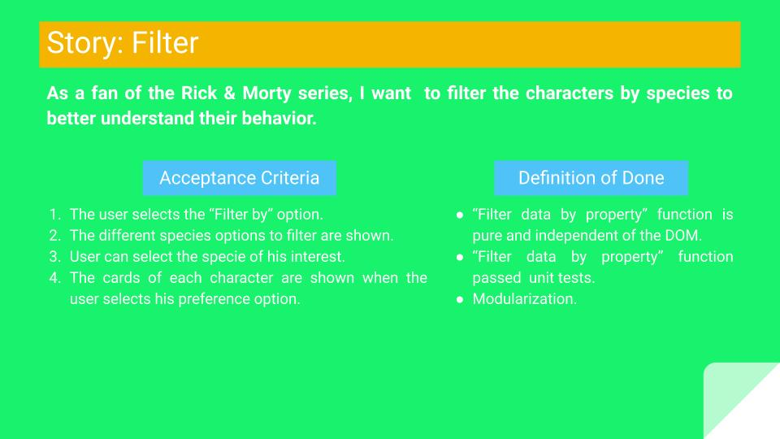
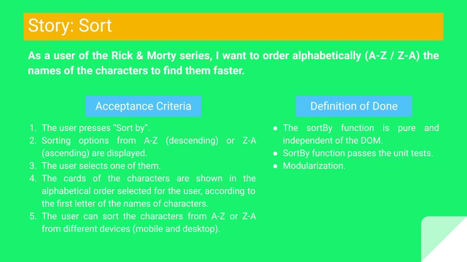
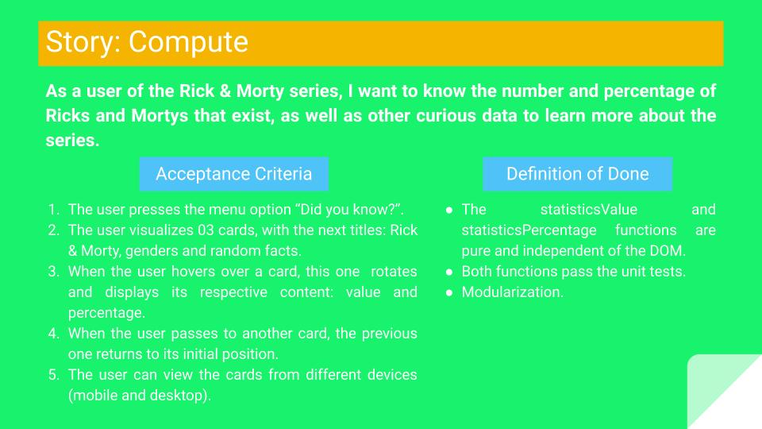
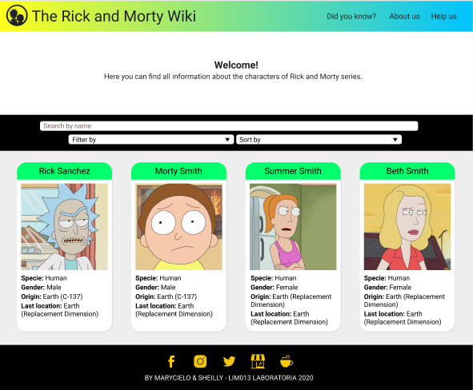
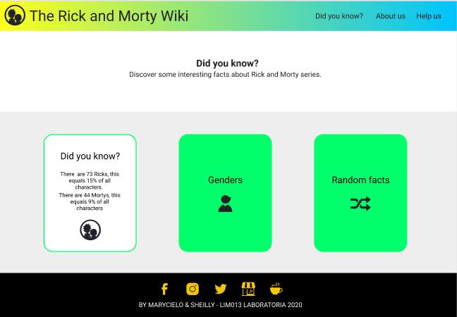
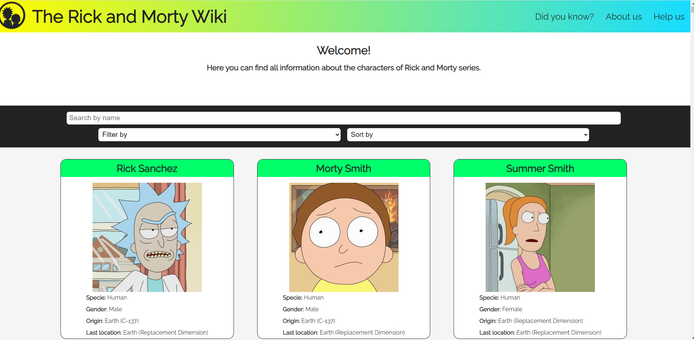

# The Rick and Morty Wiki

## Index

* [1. Product definition](#1-product-definition)
* [2. Users stories](#2-users-stories)
* [3. Low fidelity prototype](#3-low-fidelity-prototype)
* [4. High fidelity prototype](#4-high-fidelity-prototype)
* [5. Usability testing](#5-usability-testing)
* [6. Learning objectives](#6-learning-objectives)
* [7. Checklist](#7-checklist)

***

## 1. Product definition

1. **Who are the main users of the product?**
  
    The main users of the product are people in the age range of 18 to 34, who find the Rick and Morty series entertaining and have watched a few episodes and liked the series.
  
      ### Age range of users
      

      ### How much users know about Rick & Morty
      
      
      ### Why users watch Rick & Morty
      
      
2. **What are the objectives of these users in relation to the product?**

    There are several interesting aspects of the characters that users would like to know better as character facts, since there are many and it is very useful information to better understand the series.

3. **What are the most relevant data to see in the interface and why?**

    Users would much more like to see data about the characters than the list of characters or the list of episodes. In addition, within the data they consider most important are: specie, gender, place of origin and the last location. Also, they mention that the "status" data would be a spoiler to new users. 

    

    
    

4. **When do they use or would they use the product?**

    Users mention that they would use the product when they want to know more about a character and when they need more information to better understand the series (timeline according to the last location of the character for example).

## 2. Users stories

## 3. Low fidelity prototype

#### First prototype

#### Home page to mobile version in Balsamiq

#### Did you know page to mobile version in Balsamiq

## 4. High fidelity prototype

### Mobile version

    [Figma Mobile Version.](https://www.figma.com/proto/8CaF8N5V4TjhbuZUgDxiZU/Rick-%26-Morty-mobile-version?node-id=4%3A0&scaling=scale-down)
    [Zeplin Mobile Version.](https://zpl.io/scene/bJe51LE)

### Desktop version

    [Figma Desktop Version.](https://www.figma.com/proto/53c6jWT5vyU5u6h4LFWNQL/Rick-and-Morty-desktop?node-id=11%3A33&scaling=min-zoom)
    [Zeplin Desktop Version.](https://scene.zeplin.io/project/5f59c9be607508819f1d6403)

## 5. Usability testing

Feedback:

- Due to there are many cards (493 characters), it was difficult for the user to return to the top and filter/order or search again, so the fixed bar was implemented.

- Users liked the color palette used, because they represent the colors of the series, so in the header the yellow color is for Morty's t-shirt and the light blue color at the other end represents Rick's hair. In addition, the green intermediate color also typical of the series, however, users recommended highlighting the cards a little bit more, for that reason the properties box-shadow and a border-color were implemented on the cards.

- Users suggested highlighting the search, filtering and sort bar more, so the color was changed to black. 

## 6. Learning objectives

El objetivo principal de este proyecto es que aprendas a diseñar y construir una
interfaz web donde se pueda visualizar y manipular data, entendiendo lo que el
usuario necesita.

### HTML y CSS

* [ ] [Uso de HTML semántico.](https://developer.mozilla.org/en-US/docs/Glossary/Semantics#Semantics_in_HTML)
* [ ] Uso de selectores de CSS.
* [ ] Construir tu aplicación respetando el diseño realizado (maquetación).
* [ ] [Uso de flexbox en CSS.](https://css-tricks.com/snippets/css/a-guide-to-flexbox/)

### DOM y Web APIs

* [ ] Uso de selectores del DOM.
* [ ] Manejo de eventos del DOM.
* [ ] [Manipulación dinámica del DOM.](https://developer.mozilla.org/es/docs/Referencia_DOM_de_Gecko/Introducci%C3%B3n)
(appendChild |createElement | createTextNode| innerHTML | textContent | etc.)

### JavaScript

* [ ] Uso de condicionales (if-else | switch | operador ternario)
* [ ] Uso de bucles (for | for..in | for..of | while)
* [ ] Uso de funciones (parámetros | argumentos | valor de retorno)
* [ ] Manipular arrays (filter | map | sort | reduce)
* [ ] Manipular objects (key | value)
* [ ] Uso ES modules ([`import`](https://developer.mozilla.org/en-US/docs/Web/JavaScript/Reference/Statements/import)
| [`export`](https://developer.mozilla.org/en-US/docs/Web/JavaScript/Reference/Statements/export))
* [ ] Diferenciar entre expression y statements.
* [ ] Diferenciar entre tipos de datos atómicos y estructurados.

### Testing

* [ ] [Testeo unitario.](https://jestjs.io/docs/es-ES/getting-started)

### Estructura del código y guía de estilo

* [ ] Organizar y dividir el código en módulos (Modularización)
* [ ] Uso de identificadores descriptivos (Nomenclatura | Semántica)
* [ ] Uso de linter (ESLINT)

### Git y GitHub

* [ ] Uso de comandos de git (add | commit | pull | status | push)
* [ ] Manejo de repositorios de GitHub (clone | fork | gh-pages)
* [ ] Colaboración en Github (branches | pull requests | |tags)

### UX

* [ ] Diseñar la aplicación pensando y entendiendo al usuario.
* [ ] Crear prototipos para obtener feedback e iterar.
* [ ] Aplicar los principios de diseño visual (contraste, alineación, jerarquía)
* [ ] Planear y ejecutar tests de usabilidad.

## 7. Checklist

* [ ] Usa VanillaJS.
* [ ] No hace uso de `this`.
* [ ] Pasa linter (`npm run pretest`)
* [ ] Pasa tests (`npm test`)
* [ ] Pruebas unitarias cubren un mínimo del 70% de statements, functions y
  lines y branches.
* [ ] Incluye _Definición del producto_ clara e informativa en `README.md`.
* [ ] Incluye historias de usuario en `README.md`.
* [ ] Incluye _sketch_ de la solución (prototipo de baja fidelidad) en
  `README.md`.
* [ ] Incluye _Diseño de la Interfaz de Usuario_ (prototipo de alta fidelidad)
  en `README.md`.
* [ ] Incluye link a Zeplin en `README.md`.
* [ ] Incluye el listado de problemas que detectaste a través de tests de
  usabilidad en el `README.md`.
* [ ] UI: Muestra lista y/o tabla con datos y/o indicadores.
* [ ] UI: Permite ordenar data por uno o más campos (asc y desc).
* [ ] UI: Permite filtrar data en base a una condición.
* [ ] UI: Es _responsive_.
